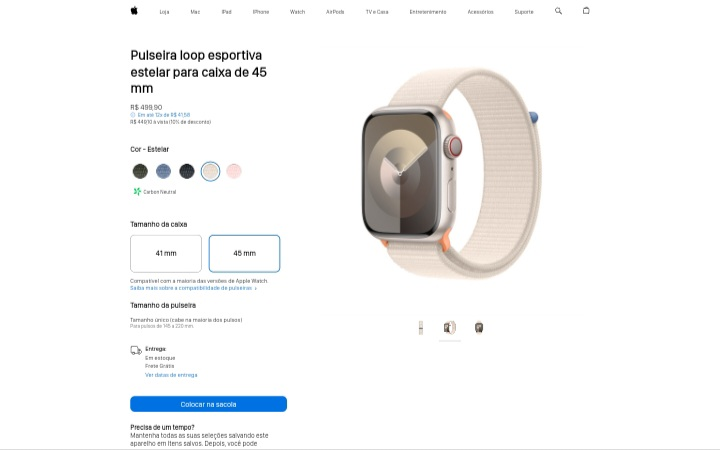

## 📱 Apple Watch Clone
Clone de uma parte do site da Apple Watch. Foi o projeto do segundo dia do Intensivão de JavaScript da [Hashtag Treinamentos](https://youtube.com/@HashtagProgramacao?si=-M1aRzBpNVh4okNX), durante o projeto aprendi como mudar a visualização de imagens de acordo com o clique do usuário com métodos de string.

***
## 🖥 Linguagens usadas
 

